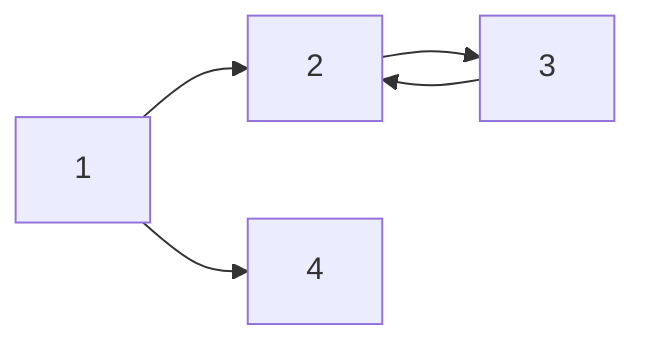

# markdown.md
**markdown Practice**
# H1 tag.
## H2 tag
### H3 tag
#### H4 tag
##### H5 tag 여기부턴 일반 글씨와 같다
\#를 5개 이상 쓰면 잘못된 분류이다

*이탤릭*
_underbar_

**bold**
**_bold+italic_**
***bold+italic***

~~hello~~ 줄이 그어진다
> 이렇게 쓰면 quote.인용할때쓴다 -**soon**

---
### list 설명
* list 1
* list 2
* list 3
    - A
        - B
1. list 1
2. list 2
3. list 3
    1. A
        1. B

### 표 설명
|제목|description|비고|
|----|----------|----|
|안녕|1         |2   |
|헬로|3         |4   |

---
> **이건 그냥 줄**

####링크 넣는법
[네이버](https://naver.com) <- 링크삽입

html 방식도 가능
<a href="https://naver.com">네이버</a>

image 넣는법


`simple code`
```cpp
#include <studio.h>

int main(){
    printf("hello world");
    return 0;
}
```

```python

```

```sh
hello
```

---
carbon 이라는 프로그램에서 (mac?)코드를 스크린샷 한다

---

## tex 문법

I think $a+b=c$ that...

다음 중 n개를 고르시오.$$(\alpha + \beta)^2 = \alpha^2 + 2 \alpha \beta + \beta^2$$답 3

$$min_Gmax_D$$

$\frac{1}{2} * 2 = 1$

---

